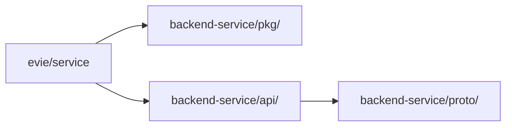

# evie/service · 平台基础管理后台服务

> **定位：** Ark Tech Platform 技术中台的后端承载服务，也是 `backend-service` 中新服务的**参考样板**。

---

## 服务职责

本服务承载技术中台的所有后端能力：

| 模块 | 说明 |
|------|------|
| 租户底座 | CRUD、生命周期、原子开通事务、多产品线叠加 |
| 认证授权 | JWT 双 Token、Casbin RBAC、平台/租户双域权限 |
| 套餐与配额 | 租户菜单权限组、版本化、能力包、资源额度 |
| 用户与组织 | 用户 CRUD、部门、岗位、角色、菜单 |
| 异步任务 | 持久化、租约抢占、幂等、重试、Handler 反注入 |
| 文件中心 | 多 Provider（S3/Local）、额度检查、访问日志 |
| 通知中心 | 模板、站内信、异步发送、已读追踪 |
| 参数配置 | 定义/覆盖、类型约束、版本缓存 |
| 操作审计 | append-only、脱敏、分层存储 |
| 数据权限 | 五级范围、部门层级链 |
| Webhook | 事件订阅、签名投递、失败重试、人工重放 |

---

## 目录结构

```
app/evie/service/
├── cmd/
│   ├── server/          # 主进程入口 (main.go → wire → kratos.App)
│   │   └── assets/      # 内嵌 Swagger UI + OpenAPI YAML
│   ├── migrate/         # 数据库迁移入口
│   └── mock/            # 模拟模式入口
├── configs/             # 配置文件 (config.yaml)
├── internal/
│   ├── authzpolicy/     # 平台控制面操作分类
│   ├── biz/             # 业务逻辑层（UseCase + Repo 接口）
│   ├── conf/            # 配置结构（由 proto 生成）
│   ├── data/            # 数据层（Repository 实现 + Ent Schema + Privacy）
│   │   └── ent/
│   │       ├── schema/  # Ent Schema 定义（数据库表结构）
│   │       ├── gen/     # 生成代码（勿手改）
│   │       ├── rule/    # Privacy 规则（租户隔离 + 外键保护）
│   │       ├── viewer/  # 上下文查看器（System/Tenant 上下文）
│   │       └── mixins/  # 本地 Mixin（BaseMixin、SoftDelete、TenantID）
│   ├── runtimeconfig/   # 运行时配置加载 + 校验 + 环境变量覆盖
│   ├── server/          # HTTP/gRPC 服务器 + 中间件 + AsyncTaskWorker
│   └── service/         # 传输层（Proto → Biz 适配）
├── Makefile             # 生成命令（proto/ent/wire/doc + 验证）
├── Dockerfile           # 容器构建
└── buf.typescript.gen.yaml  # 前端 TypeScript 类型生成
```

---

## 样板模式速查

新增服务时可直接复制的模式：

| 模式 | 参考文件 | 关键点 |
|------|---------|--------|
| **分层架构** | `internal/biz/` → `internal/data/` → `internal/service/` | Service 只做参数转换，Biz 做业务校验，Data 做持久化 |
| **Repo 接口定义** | `internal/biz/tenant_usecase.go` | 接口定义在 biz 层，Data 层实现 |
| **Wire 依赖注入** | `cmd/server/wire.go` + `internal/{server,service,biz,data}` | 四层 ProviderSet 分离 |
| **Ent Privacy** | `internal/data/ent/rule/tenant.go` | 租户隔离 + 类型断言 + 外键保护 Hook |
| **Ent Mixin 复用** | `internal/data/ent/mixins/base.go` | BaseMixin = ID + CreatedAt + UpdatedAt + Status + TenantID |
| **配置校验** | `internal/runtimeconfig/config.go` | 启动前校验 + 生产安全检查 + 环境变量覆盖 |
| **中间件链** | `internal/server/server.go` | Recovery → Logging → Limiter → AuthN → AuthZ → Platform → Audit → Validate |
| **平台操作守卫** | `internal/server/platform_control.go` | 用 `authzpolicy.IsPlatformControlOperation()` 分类 + `authn.IsPlatformOperator()` 鉴权 |
| **异步 Worker** | `internal/server/async_task_worker.go` | 实现 `kratos.Server` 接口，统一生命周期管理 |
| **健康检查** | `internal/data/data.go` → `NewHealthChecker` | DB ping + Redis ping + 缓存统计 |
| **原子事务** | `internal/data/tenant_repo.go` → `Provision()` | Ent Tx 内多步操作 + Casbin 策略同步 + RollbackProvisioning |
| **Unit Test 样板** | `internal/biz/tenant_usecase_test.go` | Stub 接口 + table-driven 状态机测试 |
| **Integration Test** | `internal/data/ent_privacy_integration_test.go` | SQLite 内存数据库 + Privacy 规则验证 |
| **Middleware Test** | `internal/server/server_test.go` | Mock Transporter + table-driven |

---

## 本服务的特殊约定（不适用于产品服务）

以下模式是平台层特有的，**产品服务不应复制**：

| 模式 | 说明 | 产品服务替代方案 |
|------|------|----------------|
| `platformControlServer()` | 平台操作员四重校验 | 不需要，产品服务无平台控制面 |
| `entviewer.NewSystemContext()` | 绕过租户隔离的系统上下文 | 产品服务不应有系统级旁路 |
| `IsPlatformControlOperation()` | 操作分类白名单 | 产品服务不需要区分平台/租户 ops |
| Tenant schema 无 `TenantID` mixin | 租户表本身是顶层实体 | 产品服务所有业务表必须有 TenantID |
| `internal/authzpolicy/` | 平台操作权限策略 | 产品服务不需要 |

---

## 关键依赖



- **`pkg/auth/`** — JWT 认证、Casbin 授权、中间件、登录尝试防护
- **`pkg/entgo/mixin/`** — 共享 Ent Mixin（ID、CreatedAt、UpdatedAt、Status）
- **`pkg/aip/listing/`** — AIP 标准分页/过滤/排序
- **`api/evie/service/v1`** — 平台管理 API（由 proto 生成）
- **`api/core/service/v1`** — 核心服务 API（由 proto 生成）

---

## 验证命令

```bash
# 生成所有派生代码并验证一致性
make generate-check

# 运行所有测试
go test ./internal/...

# 运行 race detection
make race

# 单独运行集成测试
go test -tags=integration ./internal/data/ -run TestEntPrivacy
```

---

## 更多参考

- 架构全景：[`docs/architecture/0-0-架构总览-架构总览.md`](../../../docs/architecture/0-0-架构总览-架构总览.md)
- 开发规范：[`docs/vibe-coding/backend/README.md`](../../../docs/vibe-coding/backend/README.md)
- Kratos 分层：[`docs/architecture/0-2-架构总览-技术栈与工程基线.md`](../../../docs/architecture/0-2-架构总览-技术栈与工程基线.md)
- 测试策略：[`docs/architecture/4-5-治理-测试策略.md`](../../../docs/architecture/4-5-治理-测试策略.md)
