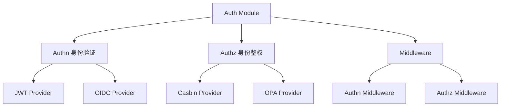

# 公共工具包 (pkg)

## 目录说明

该目录用于存放所有微服务可共用的工具包和组件。遵循 Go-Kratos 微服务项目规范，按功能模块划分子目录：

```
pkg/
├── auth/          # 认证相关
│   ├── jwt/       # JWT 工具
│   └── oauth/     # OAuth 认证
├── cache/         # 缓存组件
│   ├── redis/     # Redis 实现
│   └── memory/    # 内存缓存实现
├── constants/     # 公共常量定义
├── database/      # 数据库工具
│   ├── mysql/     # MySQL 工具
│   └── mongo/     # MongoDB 工具
├── errors/        # 错误处理
├── logger/        # 日志工具
├── middleware/    # 中间件
│   ├── cors/      # 跨域处理
│   ├── metrics/   # 监控指标
│   └── trace/     # 链路追踪
├── utils/         # 通用工具函数
│   ├── convert/   # 类型转换
│   ├── encrypt/   # 加密解密
│   ├── time/      # 时间处理
│   └── validator/ # 数据验证
└── queue/         # 消息队列
    ├── kafka/     # Kafka 实现
    └── rabbitmq/  # RabbitMQ 实现
```

## 使用规范

1. 包名规范
   - 使用小写字母
   - 简短且有意义
   - 避免使用下划线

2. 接口规范
   - 接口名使用大驼峰命名
   - 方法名应表达清晰的功能意图
   - 提供完整的接口文档

3. 错误处理
   - 统一使用 `pkg/errors` 包
   - 错误信息应清晰明确
   - 提供错误堆栈信息

4. 版本控制
   - 遵循语义化版本规范
   - 重大更新需要充分的测试和文档
   - 保持向后兼容性

5. 依赖管理
   - 明确声明外部依赖版本
   - 避免引入不必要的依赖
   - 定期更新依赖版本

6. 测试要求
   - 提供单元测试
   - 保持测试覆盖率
   - 包含基准测试（适用场景）

## 贡献指南

1. 代码风格
   - 遵循 Go 官方代码规范
   - 使用 gofmt 格式化代码
   - 通过 golint 检查

2. 文档要求
   - 提供详细的 README
   - 包含示例代码
   - 注释完整清晰

3. 提交规范
   - 清晰的提交信息
   - 适当的改动范围
   - 通过 CI 测试


## Go-Auth 身份认证模块-开发提示词（Prompt）内容

---
### 开发助手提示词（口语版）
我正在开发一个身份认证模块，所在当前项目的pkg目录下，模块名称为go-auth，路径 pkg/go-auth。

角色：请作为一个golang编程语言的架构师或者是资深开发工程师完成我的需求，项目使用go-kratos微服务框架搭建。在身份认证模块中需要包含身份验证（简写：anthn）和身份鉴权（简写：anthz）子模块，因为这个是作为身份认证模块所以还需要增加中间件。

--- 

### 开发助手提示词（AI版）

你是一个资深 Golang 架构师，请使用 Go 语言，基于 go-kratos 微服务框架，开发一个通用的身份认证模块 `go-auth`，其路径为 `pkg/go-auth`。该模块需同时支持身份验证（Authn）与身份鉴权（Authz），具备如下要求：

模块要求：模块设计需具备通用可扩展特性，同时让逻辑解耦、可插拔等能够接入兼容多种主流协议与后端提供者。

设计原则：
* 接口驱动设计（Interface-based Design）
* 依赖反转原则（Dependency Inversion）
* 开闭原则（Open/Closed Principle）
设计目标：
* 模块通用、可插拔、协议无关
* 易扩展，支持多种认证与鉴权提供者
* 松耦合，使用 interface-based 设计
* 遵循 SOLID 原则（特别是开闭原则与依赖反转）

设计要求：
* 提供模块初始化方式，支持使用 Google Wire 进行依赖注入
* 参考 go-micro 与 go-kratos 插件化设计风格
* 使用清晰的包结构、接口与实现分离
* 实现至少一个 JWT 提供者作为示例

服务接口基础方法：
身份验证（Authenticator）：身份初始化（Init）、身份验证、令牌验证、令牌发放、令牌续期（刷新）、令牌注销（Destroy）、提供者名称（String/Name）、等；
身份鉴权（Authorizer）：权限初始化（Init）、权限验证、添加权限策略、权限策略注销（Destroy）、提供者名称（String/Name）、等；

备注：接口方法需要你来优化和补充，我只是给你一些基础提示。

服务提供者：
* 身份验证提供者（AuthnProvider）：Jwt 、OIDC、PSK、等；
* 身份鉴权提供者（AuthzProvider）：Casbin、OPA、Zanzibar、等；

服务中间件：
* 身份验证中间件（AuthnMiddleware）：身份验证中间件，用于身份验证和令牌验证；
* 身份鉴权中间件（AuthzMiddleware）：身份鉴权中间件，用于权限验证；

以上需求中需要你提供设计思路和编码过程，需实现至少一个提供者的。

### ✅ 接口建议

#### Authenticator 接口（身份验证）

* `Init(config any) error`
* `Authenticate(ctx context.Context, credentials any) (Principal, error)`
* `VerifyToken(ctx context.Context, token string) (Principal, error)`
* `IssueToken(ctx context.Context, p Principal) (string, error)`
* `RefreshToken(ctx context.Context, token string) (string, error)`
* `DestroyToken(ctx context.Context, token string) error`
* `Name() string`

#### Authorizer 接口（身份鉴权）

* `Init(config any) error`
* `Authorize(ctx context.Context, p Principal, resource string, action string) error`
* `AddPolicy(policy any) error`
* `RemovePolicy(policy any) error`
* `Name() string`

#### Middleware 接口建议

* `AuthnMiddleware(next http.Handler) http.Handler`
* `AuthzMiddleware(next http.Handler) http.Handler`



以上需求中需要你提供设计思路和编码过程，需实现至少一个提供者的。